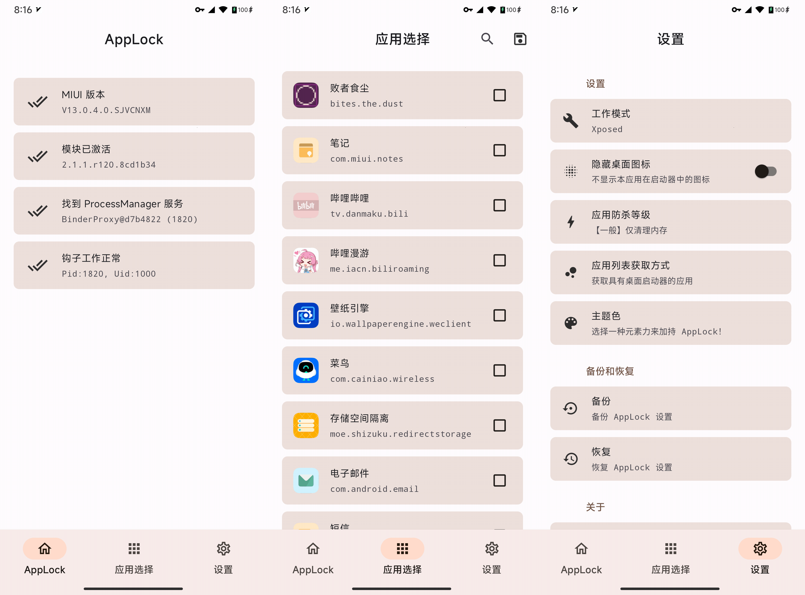

## AppLock

* 防止特定应用被侧滑杀死或一键清理

* 理论上支持 Android 9~12，MIUI 12+

* 可能也支持更低版本的 Android 和 MIUI 11，如需使用请自行测试

* 项目地址：[Mufanc/AppLock](https://github.com/Mufanc/AppLock)

* 下载链接：

| 稳定版 | 每夜版 |
| :---: | :---: |
| [模块仓库](https://github.com/Xposed-Modules-Repo/mufanc.tools.applock/releases/latest) | [Github Actions](https://github.com/Mufanc/AppLock/actions/workflows/build.yml) |
